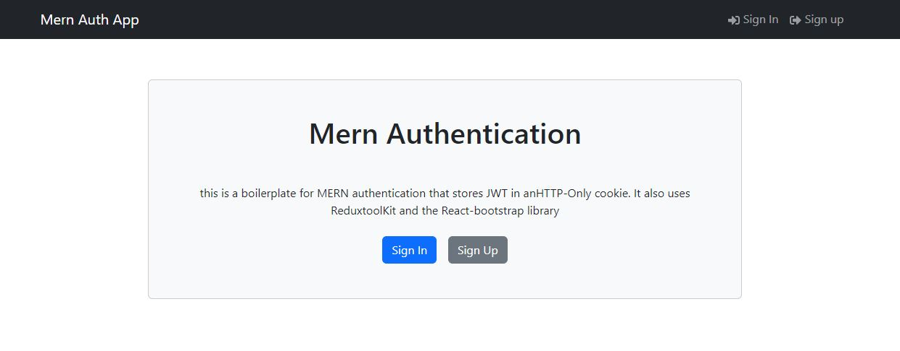

This is a Practice project that I followed from the
video :MERN Crash Course | JWT Authentication, Redux Toolkit, Deployment & More

https://www.youtube.com/watch?v=R4AhvYORZRY&t=9848s

thank you Traversy Media for sharing this project

for the .env
the environment variables required are :
"NODE_ENV = development, PORT, MONGO_URI, JWT_SECRET"!

Images of the finished practice =>

